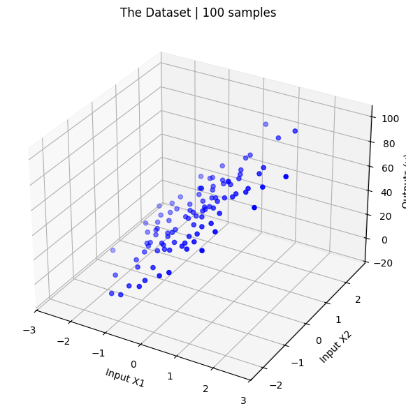
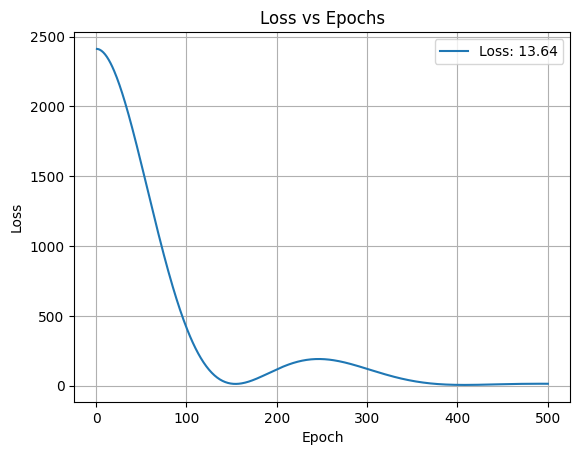
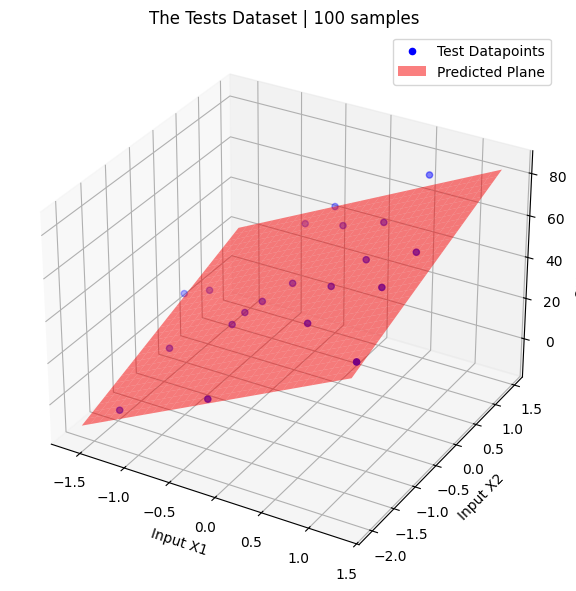

# Stage 1.2

Introducing Momentum to Optimizers
- Using Moving Average of gradients

## Content:

## TL;DR

### 🔑 Key Changes

- Momentum Based Optimizer
- Multi Input: **2**

### 📘 Info

- Linear Regression
- **Input** Features: **2**
- **Output** Features: **1**
- Loss: `MSE`
- Optimizer: `Custom Momentum-based` 
- Activation: `Linear`

### ⚠️ Limitations
- Constant Learning Rate
    - The first Moving Average mainly scales gradients. It is needed to implement the second one to scale the learning rate.

## 🔧 Implemntation

### _Content_:

1. Data Generation
2. Preprocessing the dataset
3. Pre-Training Setup
4. Training
5. Evaluation & Visualization
 
### _Requirements_:

1. numpy
2. matplotlib
3. scikit-learn

## 😎 Future Improvements:
- Optimizer: Add Second Moving Average
- Optimizer: Add Bias Correction
- Structure: Add Activation

## Results:

<h3>Dataset</h3>

<h3>Successful Training</h3>

