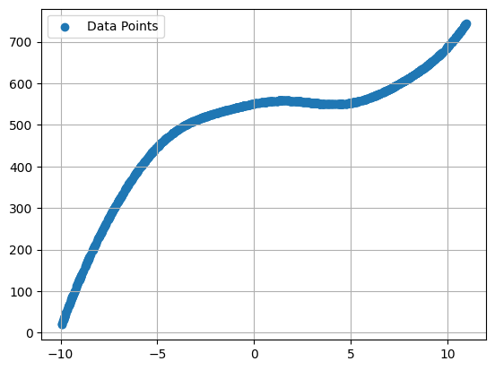
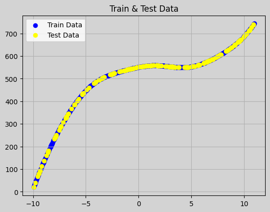
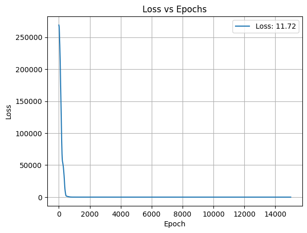
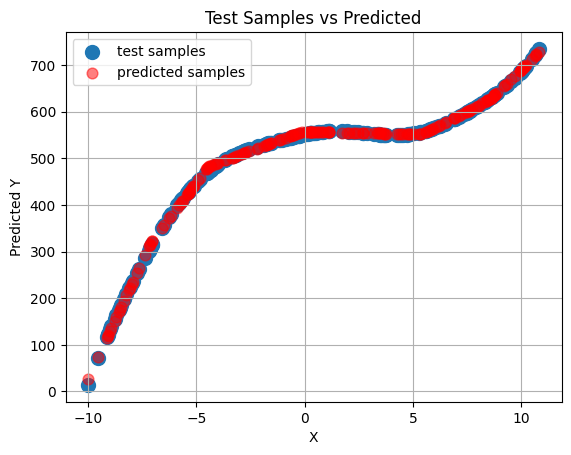

# Stage 1.2

## Content:

## TL;DR

### 🔑 Key Changes

- `HE` initialization
- Sequential model (3 layers)
- Non-linear problem

### 📘 Info

- Linear Regression
- **Layers**: **3**
- **Input** Features: **1**
- **Output** Features: **1**
- Loss: `MSE`
- Optimizer: `Adam`
- Activation: `ReLU`

### ⚠️ Limitations

## 🔧 Implemntation

### _Content_:

1. Data Generation
2. Preprocessing the dataset
3. Pre-Training Setup
4. Training
5. Evaluation & Visualization

### _Requirements_:

1. numpy
2. matplotlib
3. scikit-learn

## 😎 Future Improvements:

- Make Scalable Model

## Results:

<h3>Dataset</h3>

<h3>Successful Training</h3>

