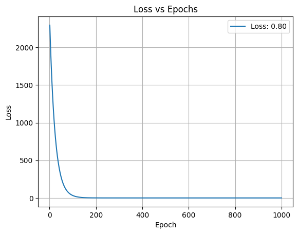
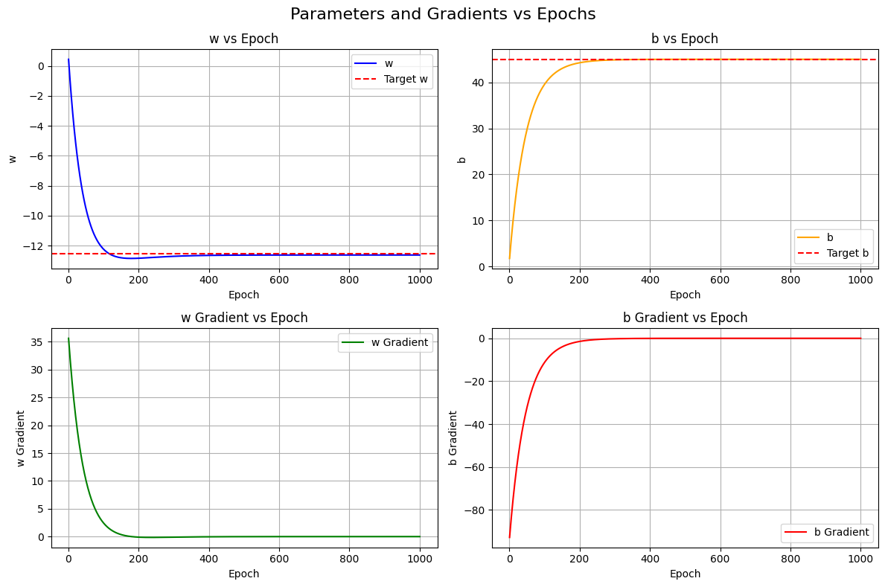
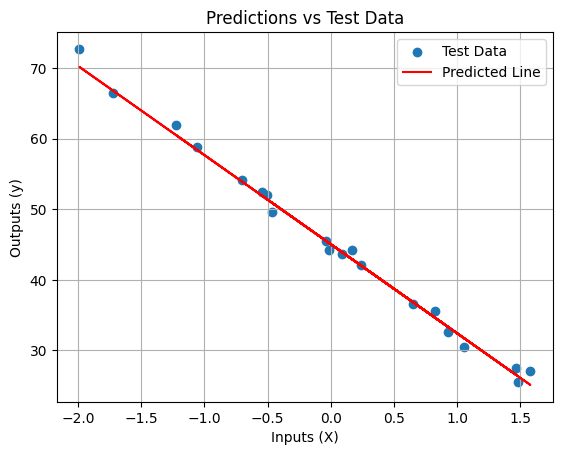

# Stage 1.0

## Content:

## TL;DR

### 📘 Info

- Linear Regression
- **Input** Features: **1**
- **Output** Features: **1**
- Loss: `MSE`
- Optimizer: None

### ⚠️ Limitations

- NO dedicated **Optimizer**
- Constant Learning Rate
- Manual weight update `w = w - gradient`
- NO batch support

## 🔧 Implemntation

### _Content_:

1. Data Generation
2. Preprocessing the dataset
3. Pre-Training Setup
4. Training
5. Evaluation & Visualization
 
### _Requirements_:

1. numpy
2. matplotlib
3. scikit-learn

## 😎 Future Improvements :

- ⚠️ Adding an Optimizer with Dynamic Learning Rate  
    - Constant Learning Rate might be okay in simple tasks like linear regression but will inevitably fail in more complex tasks.

## Results:

<h3>Successful Training</h3>

