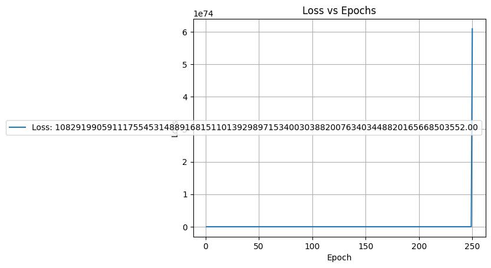
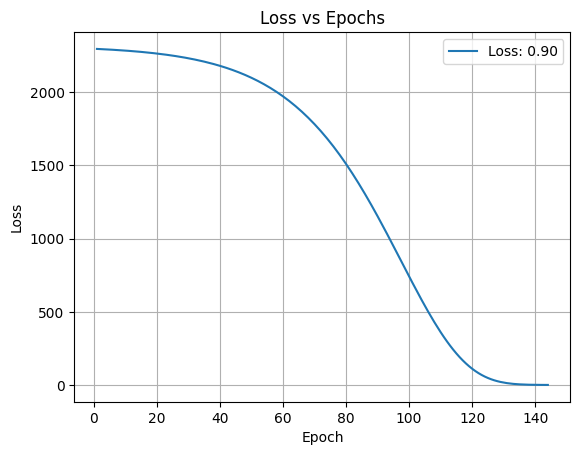
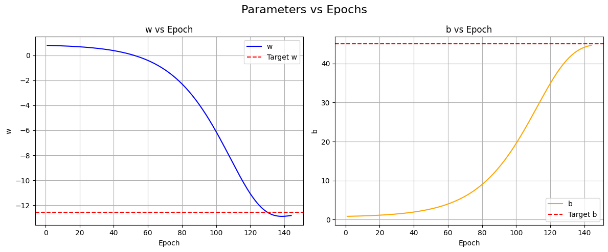
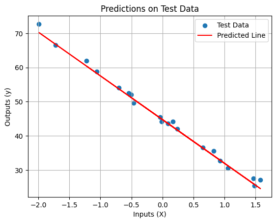

# Stage 1.1

Introducing a Learning Scheduler

## Content:

## TL;DR

### 🔑 Key Changes

- A **Custom Optimizer** with a Learning Rate Scheduler.
- Automatic weight update

### 📘 Info

- Linear Regression
- **Input** Features: **1**
- **Output** Features: **1**
- Loss: `MSE`
- Optimizer: `Custom with Learning Rate Scheduler` 
- Activation: `Linear`

### ⚠️ Limitations

- **Bad Optimizer**
    - LR Scheduler requires careful tuning & can behave aggresively on a long run.
- NO batch support

## 🔧 Implemntation

### _Content_:

1. Data Generation
2. Preprocessing the dataset
3. Pre-Training Setup
4. Training
5. Evaluation & Visualization
 
### _Requirements_:

1. numpy
2. matplotlib
3. scikit-learn

## 😎 Future Improvements:

- ⚠️ Fix Optimizer by adding momentum:
    - Current Optimizer simply uses Learning Scheduler which fails without precise tuning and on a long run. 
    - The Momentum will enable the Optimizer to naturally seek the global minima - just like a real ball rolling down from the hill. 

## Results:

<h3>Error due to Careless parameter tuning</h3>

<h3>Successful Training</h3>

